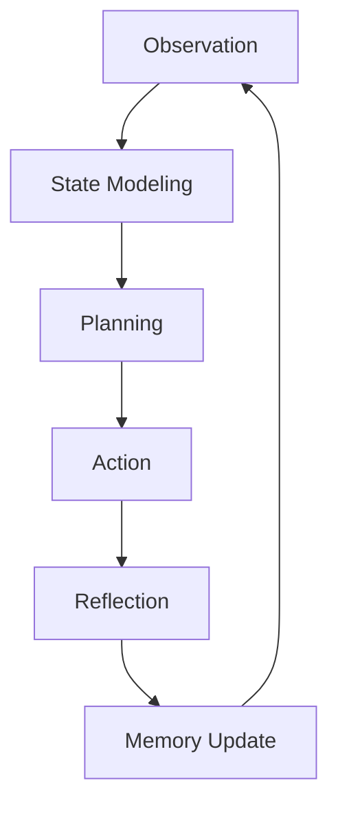

# Study Buddy — An Agentic AI Learning Tutor

Study Buddy is a research-inspired agentic AI tutor designed to move beyond simple chatbots. It implements a closed-loop agentic architecture that observes user behavior, maintains a stateful learning model, plans pedagogical strategies, and reflects on its own effectiveness.

## 🎯 Project Goal
To create an intelligent agent that:
- Maintains an internal user learning model.
- Plans teaching strategies intentionally (Explain vs. Test vs. Revise).
- Reflects on user responses to adapt depth and pacing.
- Uses long-term and short-term memory for grounded, personalized tutoring.

## 🏗️ Architecture
The system follows a modular architecture centered around the **Agentic Loop**:



### Core Components:
- **Observation Engine**: Analyzes user intent, confidence, and confusion levels.
- **State Modeler**: Maintains a persistent user profile (JSON-based) with mastery scores and topic confidence.
- **Planner**: Decides the strategy (e.g., "beginner explanation" vs "testing advanced knowledge") based on the state.
- **Action (LLM)**: Generates grounded responses using retrieved materials.
- **Reflection Engine**: Evaluates the helpfulness of its own response post-generation.
- **Memory Store**: Combines ChromaDB for RAG and local JSON for long-term user tracking.

## 🧠 Memory & Planning
- **Short-term**: Conversation context stored in session memory.
- **Long-term**: Summarized learning progress and user-specific mastery levels.
- **Grounding**: All explanations are grounded in a vector database (ChromaDB) containing curated study materials.

## 🚀 Getting Started
1. **Backend**:
   ```bash
   cd backend
   pip install -r requirements.txt
   uvicorn app.main:app --reload
   ```
2. **Frontend**:
   ```bash
   cd frontend
   npm install
   npm run dev
   ```
3. **Ingest Data**:
   ```bash
   python scripts/ingest_notes.py
   ```

## 🛠️ Technology Stack
- **Backend**: Python, FastAPI, LangChain, Ollama
- **Memory**: ChromaDB (Vector Store), JSON (User Profile)
- **Frontend**: React, Tailwind CSS, Framer Motion, shadcn/ui
